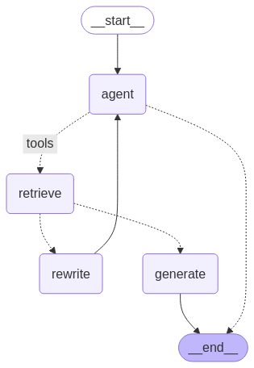

# 半导体投研知识库系统（RAG-based Semiconductor Research Q&A）

基于 RAG（Retrieval-Augmented Generation）架构构建的企业级半导体投资研究知识问答系统。针对大模型在专业金融场景下幻觉率高（传统方案准确率仅 62%）的痛点，通过混合检索、自评估机制和动态路由策略显著提升回答准确性。

---

## 系统架构

```
用户提问
   ↓
混合检索（稠密向量 + BM25）
   ↓
RRF 融合排序
   ↓
检索相关性评估（LangGraph）
   ↓ 不合格则重写重检
生成回答
   ↓
幻觉检测（LangGraph）
   ↓ 不合格则重新生成
最终输出 / 动态路由网络搜索
```



---

## 核心特性

**混合检索架构**
- 稠密向量检索（Milvus 向量数据库）+ BM25 稀疏检索
- RRF（Reciprocal Rank Fusion）算法融合双路结果
- 解决纯语义检索遗漏精确术语（如芯片型号、公司代码）的问题

**语义分块 Pipeline**
- 处理研报跨页断裂问题，保证段落语义完整性
- 结合 OCR 支持图表内容提取，提升知识入库质量

**双层自评估机制（LangGraph）**
- 第一层：检索相关性评估，不合格自动触发查询重写并重新检索
- 第二层：生成幻觉检测，不合格自动触发重新生成
- 显著降低专业场景下的幻觉率

**动态路由策略**
- LLM 自动判断问题是否超出知识库范围
- 超出范围时自动切换网络搜索，覆盖时效性内容需求

---

## 技术栈

| 组件 | 技术 |
|------|------|
| 框架 | LangChain · LangGraph |
| 向量数据库 | Milvus |
| 大语言模型 | DeepSeek-V3 |
| 稀疏检索 | BM25 |
| 融合算法 | RRF（Reciprocal Rank Fusion）|
| 编程语言 | Python 3.11 |

---

## 项目结构

```
RAG_PROJECT/
├── agent/          # Agent 核心逻辑，包含路由与决策模块
├── graph/          # LangGraph 工作流定义（检索评估 + 幻觉检测）
├── tools/          # 检索工具（向量检索、BM25、网络搜索）
├── utils/          # 工具函数（日志、环境变量、输出格式化）
├── llm_models/     # 模型初始化与配置
├── datas/          # 数据处理与分块 pipeline
├── documents/      # 文档加载与预处理
├── main.py         # 主入口
└── requirements.txt
```

---

## 快速开始

**安装依赖**
```bash
pip install -r requirements.txt
```

**配置环境变量**

在项目根目录创建 `.env` 文件：
```
DEEPSEEK_API_KEY=your_api_key
MILVUS_HOST=localhost
MILVUS_PORT=19530
```

**运行**
```bash
python main.py
```

---

## 背景

本项目针对半导体投研场景开发。半导体研报专业术语密集（芯片型号、工艺节点、公司缩写等），传统 RAG 方案在精确术语召回和事实准确性上存在明显不足，本系统通过混合检索和多层自评估机制解决这一问题。

---

*Author: Zhao Xiangzhe | UCLouvain MSc NLP | 2027*
